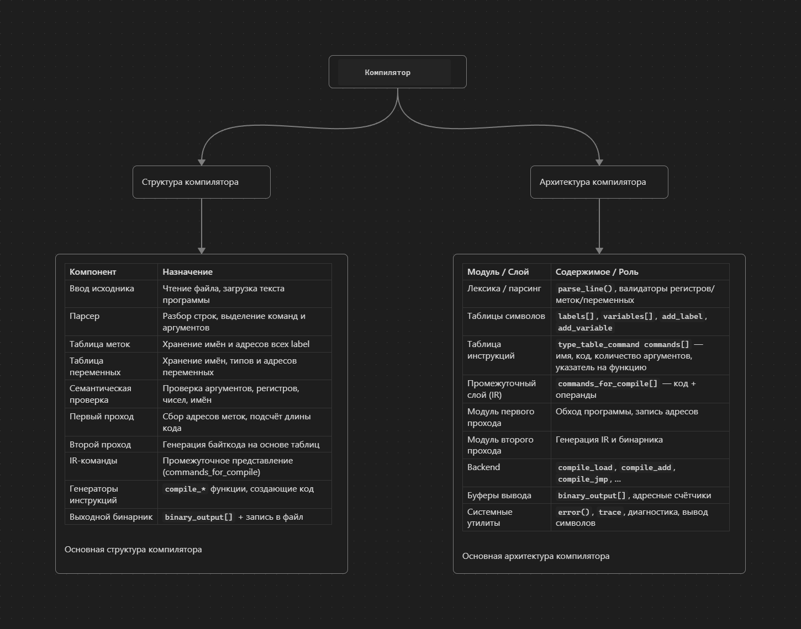
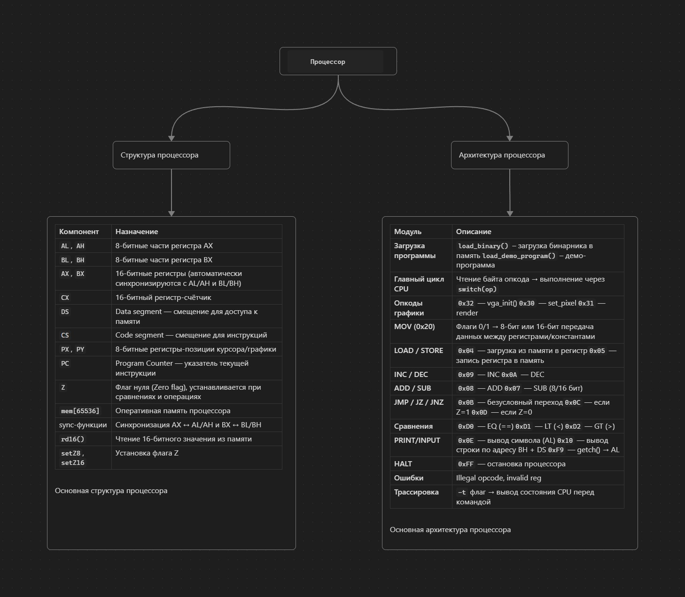
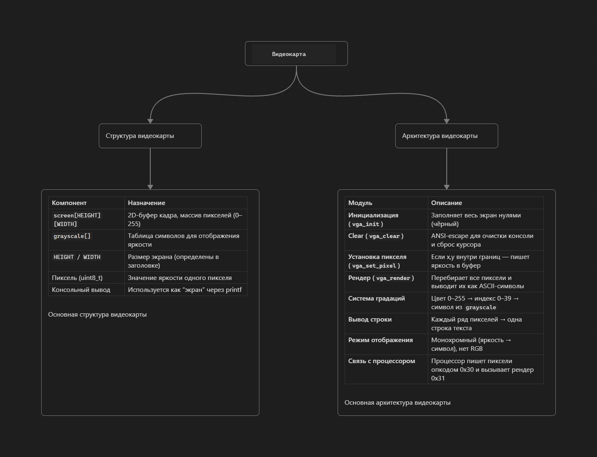

  

## 🔍 Моя цель:

Продвигать системное программирование в массы для простых людей, чтобы все видели что это не так сложно как кажется и чтобы это было доступно каждому, планирую издать свою книгу которая будет стоить копейки чтобы каждый смог увидеть как проект развивался "за кулисами" и какие были идеи, что воплотил, а что нет и по каким причинам

## 📖 Компилятор на питоне:

      store — сохраняет значение регистра в память по адресу
      load — загружает значение из памяти в регистр
      clear — очищает файлы программы
      q — завершает программу, перед закрытием компилирует
      f / stop — конец программы
      mov — перемещение данных(числа загружаются только больше 7!!! т.к. до 7 это номера регистров)
      compile - выполняет двухэтапную компиляцию
      jmp — безусловный переход
      jz — переход при нуле
      jnz — переход при ненуле
      add — сложение
      sub — вычитание
      inc — инкремент
      dec — декремент
      printstr - вывод строки, адрес начала строки хранится в регистре bh
      print — вывод
      input — ввод
      comp - сравнение двух регистров либо чисел
      >< - оператор сравнения
      setV - установка пикселя по координатам
      render - вывод видеокарты на экран
      init - инициализация видеокарты(все пиксели 0)
      com - показать список команд для компиляции
      ---: - файл сохранен
      ***: - файл не сохранен

## 📖 Компилятор на C (более новый):

      store — сохраняет значение регистра в память по адресу
      load — загружает значение из памяти в регистр
      clear — очищает файлы программы
      exit — завершает программу, перед закрытием компилирует
      stop — конец программы
      mov — перемещение данных(числа загружаются только больше 7!!! т.к. до 7 это номера регистров)
      compile - выполняет двухэтапную компиляцию
      jmp — безусловный переход
      jz — переход при нуле
      jnz — переход при ненуле
      add — сложение
      sub — вычитание
      inc — инкремент
      dec — декремент
      printstr - вывод строки, адрес начала строки хранится в регистре bh
      print — вывод
      input — ввод
      cmp - сравнение двух регистров либо чисел
      >< - оператор сравнения
      setv - установка пикселя по координатам
      render - вывод видеокарты на экран
      init - инициализация видеокарты(все пиксели 0)
      bin - показать список команд для компиляции
      reset - очистить компилятор, команды в очереди на компиляцию не удаляются
      vars/labels - список переменных и меток
      point "название метки" - создание метки
      "название переменной" = ""строковая переменная" - обязательно ставьте двойные кавычки перед строкой
      "название переменной" = "числовая переменная", если 0 - 255 то переменная будет с свойством byte(занимает 1 байт в памяти), если больше 255 то word(2 байта памяти)
      ---: - файл скомпилирован
      ***: - файл не скомпилирован (в планах)

Язык компилятора: SSwager

  

## 🏗️ Архитектура процессора:
      Таблица регистров:
      8 bit:
      |-----------------------------------------------------------------------------------------------|
      AL    Младший байт регистра AX      Основной регистр для операций ввода/вывода, арифметики
      |-----------------------------------------------------------------------------------------------|
      AH    Старший байт регистра AX      Используется в операциях с AX, может хранить данные
      |-----------------------------------------------------------------------------------------------|
      BL    Младший байт регистра BX      Универсальный регистр данных
      |-----------------------------------------------------------------------------------------------|
      BH    Старший байт регистра BX      Особая роль: используется в PRINT_STR как указатель строки
      |-----------------------------------------------------------------------------------------------|
      PX    Координата X                  Специальный регистр для графических операций
      |-----------------------------------------------------------------------------------------------|
      PY    Координата Y                  Специальный регистр для графических операций
      |-----------------------------------------------------------------------------------------------|
      16 bit:
      |-----------------------------------------------------------------------------------------------|
      AX    Аккумулятор (AL | AH)         Основной регистр для арифметических операций
      |-----------------------------------------------------------------------------------------------|
      BX    Базовый регистр (BL | BH)     Универсальный, используется для адресации
      |-----------------------------------------------------------------------------------------------|
      CX    Счетчик                       Особая роль: в MOV принимает только числа, без регистров
      |-----------------------------------------------------------------------------------------------|
      DS    Data Segment                  Сегмент данных - база для операций с памятью
      |-----------------------------------------------------------------------------------------------|
      CS    Code Segment                  Сегмент кода - база для выполнения инструкций
      |-----------------------------------------------------------------------------------------------|
      PC    Program Counter               Счетчик команд - текущая позиция в коде
      |-----------------------------------------------------------------------------------------------|
      Спец. флаги:
      |-----------------------------------------------------------------------------------------------|
      Z     Zero flag                     Устанавливается в 1, если результат операции равен 0
      |-----------------------------------------------------------------------------------------------|
      В остальном:
      Архитектура моего проекта основана на x86 процессорах, я постарался проделать все также как и там.

  

## 🎞️ Видеокарта
      Функция vga_init() инициализирует видеокарту — она заполняет весь экран чёрным цветом, устанавливая значение каждого пикселя равным 0x00.

      Функция vga_clear() очищает консольный экран, убирая все ранее отрисованные символы и подготавливая область вывода к новой отрисовке.

      Функция vga_set_pixel(x, y, color) устанавливает пиксель по координатам (x, y) в указанный цвет. Цвет задаётся значением типа uint8_t в диапазоне от 0 до 255, где число определяет яркость символа, который будет отображён на экране.

      Функция vga_render() отрисовывает текущее состояние видеопамяти, выводя содержимое буфера на экран и делая все изменения видимыми для пользователя.

  

## Документация

[Тут тыкнуть](docs/cpu.md)

## 🖥️ О проекте LETOS

LETOS — это учебный компилятор и эмулятор процессора, созданный для демонстрации принципов системного программирования. 
Проект ориентирован на новичков и позволяет изучить основы архитектуры процессоров, командного набора и написания низкоуровневого кода.

## ⚙️ Требования

- Python 3.11+
- Git
- Любая ОС с поддержкой терминала (Windows / Linux / macOS)

## 🚀 Установка и запуск

1. git clone https://github.com/TaynoDernyl/OS.git
   cd OS cd "OS files"
2. ./letos.exe или .\letos(для линукса и мака) (бинарник с кодом) (флаг -t для трассировки) - наш процессор
3. python ./assembly.py (наш код на SSwager'е) - наш компилятор
4. Пробные проекты на SSwager есть в папке "programs on LETOS"

## Структура проекта:
[LETOS](/)-

[OS files](/OS%20files/)- директория с файлами для работы.

[programs on LETOS](/programs%20on%20LETOS/)- директория с пробными проектами для изучения языка.

[Документация](/docs/) - директория с документацией по проекту

## 💸 Поддержать проект

Если хочешь поддержать разработку **LETOS** — можешь отправить донат:  
👉 [Отправить донат](https://t.me/send?start=IVx2Bdjsc4ma)

---

### 💬 Комментарии к донатам
Каждый донат (если с комментарием) я публикую в своём канале:  
📢 [Чат с проектом](https://t.me/+IJlpkxKUCg1hNGQy)

---

### 🧠 Моя личная жизнь
Если интересно заглянуть за кулисы — вот мой личный канал:  
❤️ [t.me/SWAGNERXXX](https://t.me/SWAGNERXXX)

---

### 🖥️ Ютуб канал
На ютуб канале вы можете посмотреть видео материал проекта LETOS
❤️ [youtube.com](https://www.youtube.com/watch?v=9e23E2JPu8g)

## 📄 Лицензия
Этот проект лицензирован под Apache License 2.0.  
Подробнее: [LICENSE](https://www.apache.org/licenses/LICENSE-2.0.txt)
