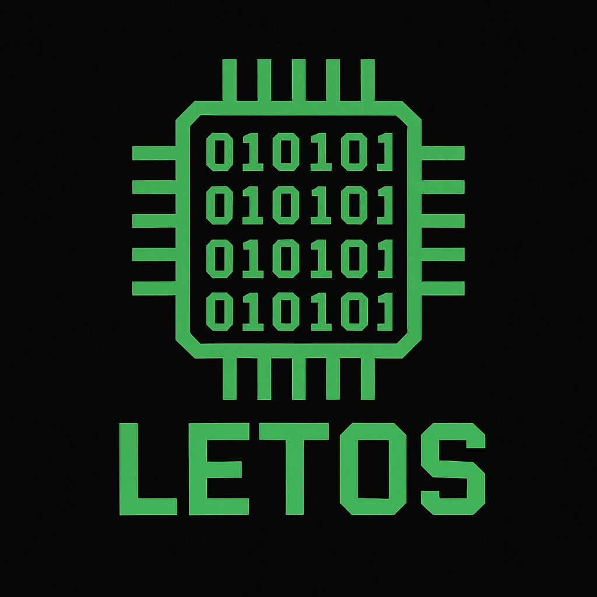
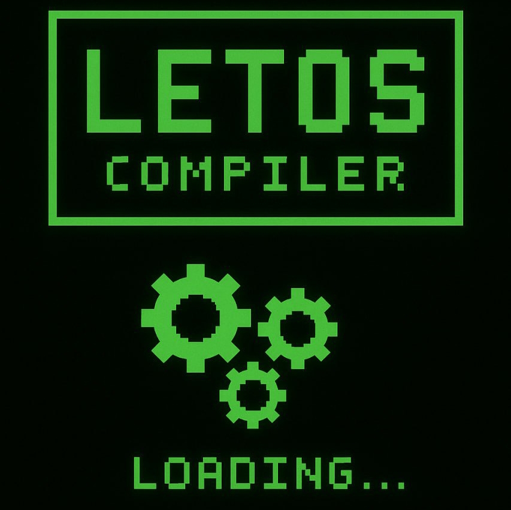

  
  

## Моя цель :
продвигать системное программирование в массы для простых людей, чтобы все видели что это не так сложно как кажется и чтобы это было доступно каждому, планирую издать свою книгу которая будет стоить копейки чтобы каждый смог увидеть как проект развивался "за кулисами" и какие были идеи, что воплотил, а что нет и по каким причинам

## 💸 Поддержать проект

Если хочешь поддержать разработку **LETOS** — можешь отправить донат:  
👉 [Отправить донат](https://t.me/send?start=IVx2Bdjsc4ma)

---

### 💬 Комментарии к донатам
Каждый донат (если с комментарием) я публикую в своём канале:  
📢 [t.me/+3c-lZf-wDcVmYzA6](https://t.me/+3c-lZf-wDcVmYzA6)

---

### 🧠 Моя личная жизнь
Если интересно заглянуть за кулисы — вот мой личный канал:  
❤️ [t.me/SWAGNERXXXHOFTARCTIZ](https://t.me/SWAGNERXXXHOFTARCTIZ)

Рабочий процессор, работает с бинарниками.

      0x00 - nop
      0x04 - LOAD reg, [addr16] загрузка из памяти в регистр
      0x05 - STORE [addr16], reg это у нас загрузка в память из регистра
      0х07 - вычесть из reg1 - reg2, сохраняется в reg1, флаг Z=1 если reg1 == 0
      0х08 - сложить reg1 и reg2, сохраняется значение в reg1, флаг Z=1 если reg1 == 0
      0х09 - inc reg, флаг Z=1 если reg == 0
      0x0A - dec reg, флаг Z=1 если reg == 0
      0x0B - JMP 16 битный адресс
      0х0С - JZ если Z==1 переход на 16 адрес
      0х0D - JNZ если Z==0
      0x0E - выводит значение из регистра АL
      0x20 - MOV принимает 3 значения flag и A B если флаг равен 0 то будет ожидаться 8 битный регистр, если 1 то 16 битный
      0xF9 – INPUT (ввод байта с клавиатуры в AL)
      0xD0 – CMP A,B (сравнение A и B → флаг Z=1 если равны)
      0хFF - HLT

help для компилятора:

      store — сохраняет значение регистра в память по адресу
      load — загружает значение из памяти в регистр
      clear — очищает файлы программы
      q — завершает программу
      f / stop — конец программы
      mov — перемещение данных(числа загружаются только больше 7!!! т.к. до 7 это номера регистров)
      compile - выполняет двухэтапную компиляцию
      jmp — безусловный переход
      jz — переход при нуле
      jnz — переход при ненуле
      add — сложение
      sub — вычитание
      inc — инкремент
      dec — декремент
      printstr - вывод строки, адрес начала строки хранится в регистре bh
      print — вывод
      input — ввод
      com - показать список команд для компиляции
      ---: - файл сохранен
      ***: - файл не сохранен

Язык моего компилятора: SSwager
